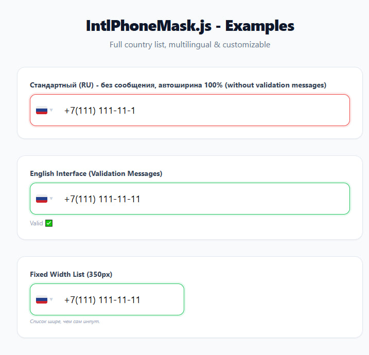

[EN -  RU](#ru)

# IntlPhoneMask 🌍

Ultra-lightweight **Vanilla** JavaScript library for international phone inputs with automatic flag detection, masking, and validation.



***

## ENGLISH

### Overview

IntlPhoneMask is a high-performance, dependency-free alternative to intl-tel-input focused on modern UX and minimal bundle size.
It supports automatic country detection by dial code, smart masking, real-time validation, and a fully customizable UI.

### Features

- Zero dependencies, pure Vanilla JS.
- Tiny footprint compared to typical intl phone libraries.
- Smart masking based on selected country or typed digits.
- Live search by country name (RU/EN) or dial code.
- Real-time validation with CSS states for valid/invalid.
- SVG flags loaded via CDN, no local image assets.
- Easy styling of dropdown, flags, and input via CSS.

***

## Installation

You can include the compiled files directly via `<link>` and `<script>`.

```html
<link rel="stylesheet" href="intl-phone-mask.css">
<script src="intl-phone-mask.min.js"></script>
```


***

## Basic Usage

### 1. HTML

Use a regular input field and an optional element for validation status.

```html
<input type="text" id="phone" placeholder="Enter phone number">
<div id="status"></div>
```


### 2. Initialization

Call `IntlPhoneMask.init` with a CSS selector and options.

```js
IntlPhoneMask.init('#phone', {
  lang: 'en',          // 'en' or 'ru'
  fixedWidth: true,    // optional: fix dropdown width to 350px
  statusSelector: '#status' // optional: selector for validation text
});
```

You can pass any CSS selector (class, id, or attribute) and multiple inputs will be initialized if they match.

***

## Configuration

| Option | Type | Default | Description |
| :-- | :-- | :-- | :-- |
| `lang` | string | `'ru'` | UI language, supports `'en'` and `'ru'`. |
| `fixedWidth` | boolean | `false` | If `true`, country list width is fixed to 350px. |
| `statusSelector` | string | `null` | CSS selector for an element that shows status text. |


***

## Validation States

IntlPhoneMask automatically toggles CSS classes on the input depending on mask completeness.

- `.state-valid`: the number length matches the current country mask.
- `.state-invalid`: the number is incomplete or too short.

Status text (e.g., “Valid”, “Incomplete”, “Waiting…”) is localized according to the `lang` option and shown in the `statusSelector` element if configured.

***

## Styling

Core layout and visual styles are controlled by CSS classes such as:

- `.intl-wrapper` – outer container.
- `.intl-select` – flag + dial code selector.
- `.intl-list` / `.intl-list.fixed-width` – dropdown list.
- `.intl-item` – country row in the list.
- `.intl-input-field` – the enhanced input element.

You can override these classes in your own stylesheet to fully match your design system.

***

## License

IntlPhoneMask is distributed under the GNU GPL-3.0 license.
You must keep the license text and notices in derivative works.

***

## Contributing

- Open issues for bugs, edge cases with specific country formats, or UX suggestions.
- Submit pull requests with clear descriptions and, if possible, small focused changes.
- Include minimal HTML examples when reporting or fixing UI issues.

***

## Performance Notes

- No runtime dependencies (no jQuery, no frameworks), which keeps the script extremely small.
- Uses a precomputed list of country codes and masks, avoiding extra network requests at runtime.

***

***

```
<a name="ru"></a>
```


## РУССКИЙ

### Обзор

IntlPhoneMask — это высокопроизводительная библиотека на чистом JavaScript для ввода международных телефонов с автоматическим определением страны, маской и валидацией.
Она создана как лёгкая альтернатива intl-tel-input с современным интерфейсом и минимальным размером бандла.

### Возможности

- Без зависимостей, только чистый JavaScript.
- Очень небольшой размер по сравнению с типичными библиотеками для телефонов.
- Умная маска в зависимости от выбранной страны или набранного кода.
- Живой поиск по названию страны (RU/EN) или телефонному коду.
- Валидация в реальном времени через CSS-состояния поля ввода.
- SVG-флаги загружаются с CDN, не занимая место в проекте.
- Простая кастомизация выпадающего списка и инпута через CSS.

***

## Установка

Вставьте код на страницу или подключите файлы через `<link>` и `<script>`.

```html
<link rel="stylesheet" href="intl-phone-mask.css">
<script src="intl-phone-mask.min.js"></script>
```


***

## Базовое использование

### 1. HTML

Обычное поле ввода и опциональный блок для статуса валидации.

```html
<input type="text" id="phone" placeholder="Введите номер телефона">
<div id="status"></div>
```


### 2. Инициализация

Вызовите `IntlPhoneMask.init` с CSS-селектором и опциями.

```js
IntlPhoneMask.init('#phone', {
  lang: 'ru',          // 'ru' или 'en'
  fixedWidth: true,    // опция: фиксированная ширина списка (350px)
  statusSelector: '#status' // опция: элемент для текста статуса
});
```

Можно передать любой CSS-селектор; все подходящие инпуты будут инициализированы.

***

## Параметры конфигурации

| Параметр | Тип | По умолчанию | Описание |
| :-- | :-- | :-- | :-- |
| `lang` | string | `'ru'` | Язык интерфейса: `'en'` или `'ru`. |
| `fixedWidth` | boolean | `false` | Если `true`, список стран имеет фиксированную ширину 350px. |
| `statusSelector` | string | `null` | CSS-селектор элемента для вывода текста валидации. |


***

## Состояния валидации

Библиотека автоматически переключает CSS-классы на инпуте в зависимости от длины номера относительно маски.

- `.state-valid`: номер соответствует длине маски выбранной страны.
- `.state-invalid`: номер неполный или слишком короткий.

Текст статуса (например, «Корректно», «Неполный номер», «Ожидание…») отображается в элементе `statusSelector` и локализуется по параметру `lang`.

***

## Стилизация

Ключевые классы вёрстки и стилей:

- `.intl-wrapper` — внешний контейнер компонента.
- `.intl-select` — зона выбора флага и кода.
- `.intl-list` / `.intl-list.fixed-width` — выпадающий список стран.
- `.intl-item` — строка с отдельной страной.
- `.intl-input-field` — улучшенное поле ввода.

Переопределяйте эти классы в своём CSS, чтобы вписать компонент в дизайн проекта.

***

## Лицензия

IntlPhoneMask распространяется по лицензии GNU GPL-3.0.
Сохранение текста лицензии и уведомлений обязательно при модификации и распространении.

***

## Вклад в проект

- Сообщайте о багах, странных форматах для отдельных стран и UX-проблемах.
- Отправляйте pull request’ы с небольшими, хорошо описанными изменениями.
- При ошибках интерфейса прикладывайте минимальный HTML-пример воспроизведения.

***

## Заметки о производительности

- Нет внешних зависимостей, поэтому скрипт остаётся очень лёгким.
- Используется заранее подготовленный список стран и масок, без дополнительных запросов в рантайме.
